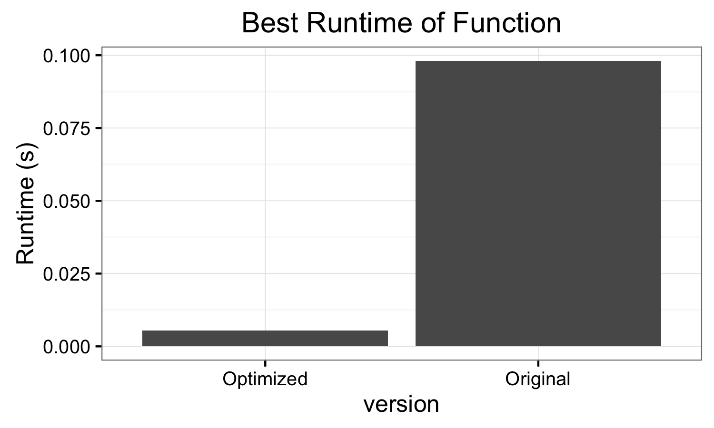

# read-stock-quotes
Work done by Will Jones.

This is from an assignment in Advanced Topics in Computer Systems at Reed College.
Here, we attempt to optimize a function that takes an array of character strings
(that are numbers) and converts them to an array of numbers. The function we
are optimizing is given a pointer to the array of numbers.



## Data Observations

Any patterns in the data were fair game, so we looked at the data. All the
numbers are either 3, 4, or 5 digit numbers, with the vast majority being
4 digit numbers.

## Optimizations

The function we are optimizing can be found in `build/converter.c`. The original
loop was simply

```c
nums[i] = atoi(lines[i]);
```

I needed another way to convert the characters to integers. The approach I
implemented took advantage of [the fact that the integer representation of
any numeric character is greater than zero by exactly that characters value.
](http://stackoverflow.com/questions/781668/char-to-int-conversion-in-c)
For example, when the string `"5"` is converted to an integer, that integer is
5 greater than the representation of `"0"`.

So we extract the `j`th digit from the `i`th number string with
```c
const char* zero_char = "0";
const int zero = (int)zero_char[0];

(int)lines[i][j] - zero
```

This gave me a huge performance boost. The next big performance improvement
was delaying the subtracting of the zero until the end. Instead of subtracting
the integer representation of `"0"` from each digit, I could subtract 111 times
(or 1,111 or 11,111 times, depending on the size of the number) that integer
representation at the end. Precomputing these multiples of that integer
representation before the main loop and then subtracting them at the end of
the digit loop gave another boost in performance.

I also tried making the loop run in parallel. There are no dependencies between
the different iterations of the loop, so it should lend itself well to being
run in multiple threads in parallel. I attempted to use OpenMP, which required
me to switch compilers from `clang`, which is the default in Mac OS, to `gcc-5`.
This gave me a performance boost, but it wasn't because of the multithreading;
having multiple threads slowed it down! It seems that the overhead of setting
up the separate processes is too great for this optimization, but at least I
discovered a more efficient compiler.

The final optimization I made was to unroll the loop for the digits. This
almost halved the run time. In some situations, the compiler will unroll the
loop automatically, but in this case it couldn't tell how much to unroll it
because the length was dependent on the length of the string. Because I knew
the strings were either 3, 4 or 5 digits long, I unrolled the loop to 3 iterations
and added if statements to check whether it should look at the next digits. It
seems either the compiler had a much easier time optimizing that or the processor
was able to prefetch more efficiently in this situation.
