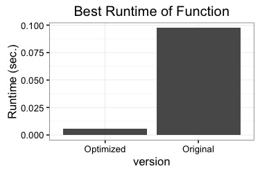

# read-stock-quotes
Work done by Will Jones.

This is from an assignment in Advanced Topics in Computer Systems at Reed College.
Here, I optimized a function that takes an array of character strings
(that are numbers) and converts them to an array of numbers. The function we
are optimizing is given a pointer to the array of numbers, in which it saves the result.
(The functions interface is described in `src/converter.h`.)



## Optimizations

The function we are optimizing can be found in `build/converter.c`. The original
loop was simply

```c
nums[i] = atoi(lines[i]);
```

Two key observations enabled my optimizations:

1.  The integer representation of any numeric character is greater 
    than zero's representation by exactly that characters value.
([See this Stack Overflow question](http://stackoverflow.com/questions/781668/char-to-int-conversion-in-c))
For example, when the string `"5"` is converted to an integer, that integer is
5 greater than the representation of `"0"`.
2. All of the integers were either 3, 4, or 5 digits long, with the vast majority being
   4 digits. (In this assignment, any patterns we saw in the data were fair game.)

Observation 1 gave me the main strategy for converting characters into numbers
extract the `j`th digit from the `i`th number string with
```c
const char* zero_char = "0";
const int zero = (int)zero_char[0];

(int)lines[i][j] - zero
```

Digits were added together aftering being multiplied by the appropriate power of ten.
(This should be pretty quick, because the compiler will rewrite multiplication by ten
as the sum (or difference) of two bitshifts, e.g. `10 * x = (x << 3) + (x << 2)`.

In additive, a little bit of speed is gained by deferring the subtraction of the zero
representation until the end. We can do this by subtracting `111 * zero` or (`1111` or `11111` times,
depending on the number of digits) at the end.

In a situation where I didn't know the length of the numbers, I would have done a for
loop iterating over all the characters of the string. However, there were only three
possible lengths here, so I could unroll the first three iterations of the loop and
put the last two in if statements. Lastly, because I knew most of the numbers were
4 digit numbers, I added a `__builtin_expect` to the if statement to help the
compiler predict the branches.

There were a couple things I tried that didn't work out:

- I tried parallelizing the code with OpenMP. Unfortunately the overhead of multiple threads
  is too large for this situation.
- I also tried using vector intrinsics; i.e. packing the integer representations into `_m128i` vectors
  and doing the arithmetic with the vectors. (The code for this is in the `vector` branch.) Again,
  the overhead cost of packing the integers into vectors was too high.
